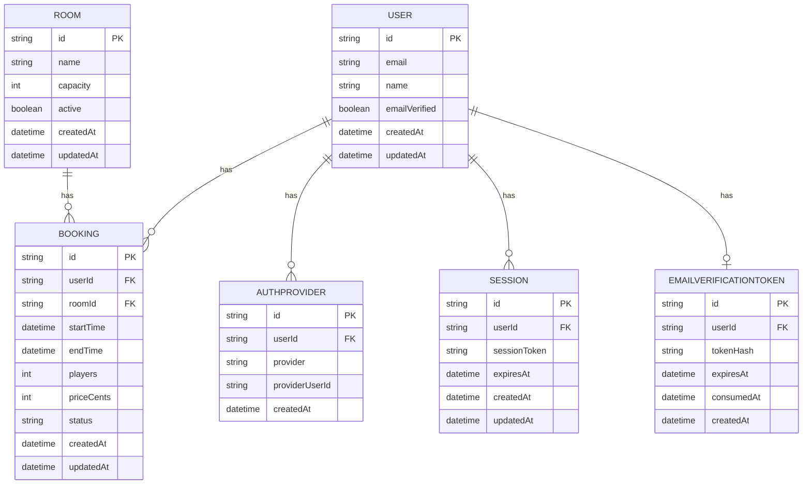
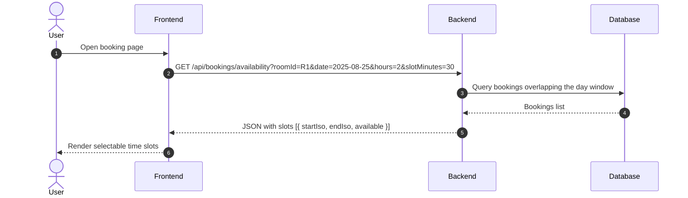

## Booking, Availability, and Auth Proposal

This document captures the suggestions discussed for improving auth flows and bookings. It includes visual diagrams, API shapes, and a concise implementation checklist.

---

## Auth verification flow (frontend-first)

```mermaid
sequenceDiagram
  autonumber
  actor U as User
  participant FE as Frontend
  participant BE as Backend
  participant EM as Email
  U->>FE: Sign up - email and password
  FE->>BE: POST /auth/register
  BE-->>FE: 200 OK (user created; session optional)
  BE->>EM: Send verification email (link to FE /verify?token=...)
  U->>FE: Click link /verify?token=...
  FE->>BE: POST /auth/verify with token
  BE-->>FE: 200 OK (verified)
  FE-->>U: Show success and redirect
  U->>FE: Click Resend (cooldown)
  FE->>BE: POST /auth/resend-verification
  BE-->>FE: 200 OK
  FE-->>U: Show countdown (e.g., 60s)
```

Notes
- Verification link routes to the frontend; the token is posted to the backend from the FE verify page.
- Frontend shows resend cooldown with a visible countdown.

---

## Auth error handling (structured and consistent)

- Backend returns clear codes and messages for login:
  - USER_NOT_FOUND
  - PASSWORD_LOGIN_NOT_ENABLED
  - EMAIL_NOT_VERIFIED
  - WRONG_PASSWORD
- Frontend displays backend message directly via a shared error component and a central error parser.
- Logout clears cookie with symmetric attributes and redirects to home.

---

## Booking model and pricing

- Inputs the customer chooses:
  - players: 1–4
  - hours: 1–4 (recommended: ~1 hour per player)
- Price formula: priceCents = players × hours × 5000 (i.e., $50 per person per hour)
- Server enforces caps for both players and hours.

```mermaid
flowchart TD
  A[Start Booking] --> B[Select room/date/time]
  B --> C[Choose players (1-4)]
  C --> D[Choose hours (1-4)]
  D --> E[Show price = players * hours * $50]
  E --> F{Available?}
  F --|No|--> B
  F --|Yes|--> G[Confirm and Create Booking]
  G --> H[Success]
```

---

## Availability and overlap prevention

### API suggestion

- GET /api/availability
  - Query: roomId, date (or range), slotMinutes (e.g., 30), openHours (e.g., 09:00–23:00)
  - Response: an array of slots with availability booleans and suggested durations

- POST /api/bookings
  - Body: { roomId: string, startTimeIso: string, players: 1-4, hours: 1-4 }
  - Server computes: endTime = startTime + hours, priceCents = players × hours × 5000
  - Rejects if overlapping or outside operating hours

### Data integrity (Postgres)

Use a database-level exclusion constraint to prevent overlaps per room. Example SQL:

```sql
-- Enable GiST support for range ops if not present
CREATE EXTENSION IF NOT EXISTS btree_gist;

-- Prevent overlapping bookings for the same room
ALTER TABLE "Booking"
ADD CONSTRAINT booking_no_overlap
EXCLUDE USING gist (
  "roomId" WITH =,
  tstzrange("startTime", "endTime", '[]') WITH &&
);
```

Notes
- Prisma does not natively model EXCLUDE; apply via raw SQL migration.
- Keep the range inclusive of start and end as needed by your policy; adjust '[]' to '[)' if end should be exclusive.

### Visual: ER overview



### Availability sequence (FE → BE → DB)



### Slot computation algorithm (no new table)

- Inputs
  - roomId, date (YYYY-MM-DD), openStart, openEnd, slotMinutes, hours (continuous)
- Steps
  1) Build dayOpen and dayClose for the venue's local date.
  2) Fetch bookings where start < dayClose AND end > dayOpen.
  3) Slide a window of size hours across the day in increments of slotMinutes.
  4) For each window [s, e), mark available if no booking overlaps (b.start < e AND b.end > s).
  5) Return slots with startIso/endIso and available flag.
- Complexity: O(N + S·logN) typical; fine for small N per day.

### Sample request and response

Request
GET /api/bookings/availability?roomId=R1&date=2025-08-25&hours=2&slotMinutes=30&openStart=09:00&openEnd=23:00

Response
{
  "meta": {
    "roomId": "R1",
    "date": "2025-08-25",
    "openStart": "09:00",
    "openEnd": "23:00",
    "slotMinutes": 30,
    "hours": 2
  },
  "slots": [
    { "startIso": "2025-08-25T09:00:00.000Z", "endIso": "2025-08-25T11:00:00.000Z", "available": true },
    { "startIso": "2025-08-25T09:30:00.000Z", "endIso": "2025-08-25T11:30:00.000Z", "available": false }
  ]
}

### Time zone handling

- Store booking timestamps in UTC.
- Interpret date/openStart/openEnd in venue local time, then convert to UTC for queries.
- Consider a VENUE_TZ config if future DST rules require robust handling.

### Buffers and business rules (optional)

- Cleaning buffer: block X minutes between end of one booking and start of the next.
  - Implement by expanding booked intervals by buffer on both sides when checking overlap.
- Lead time: require bookings to start at least Y minutes in the future.
- Cutoff: no same-day bookings after a certain time.
- Operating exceptions: holidays or maintenance closures override daily open hours.

### Optional: availability cache table (only if needed)

Use a materialized snapshot when traffic is high or constraints are complex. Invalidate on booking create/cancel.

Suggested shape (Postgres)

```sql
CREATE TABLE IF NOT EXISTS "AvailabilitySnapshot" (
  id UUID PRIMARY KEY DEFAULT gen_random_uuid(),
  roomId UUID NOT NULL,
  date DATE NOT NULL,
  slotMinutes INT NOT NULL,
  hours INT NOT NULL,
  openStart TIME NOT NULL,
  openEnd TIME NOT NULL,
  slotsJson JSONB NOT NULL,
  generatedAt TIMESTAMPTZ NOT NULL DEFAULT now(),
  UNIQUE (roomId, date, slotMinutes, hours, openStart, openEnd)
);
```

Pros
- Faster reads for popular days/rooms, simpler FE caching.

Cons
- Complexity: must invalidate on change, more storage, eventual consistency.

---

## Backend contract (concise)

Inputs/Outputs
- POST /auth/login
  - in: { email, password }
  - out 200: { user }
  - out 4xx: { code, message }

- POST /auth/verify
  - in: { token }
  - out 200: { ok: true }

- POST /auth/resend-verification
  - out 200: { ok: true }

- POST /api/bookings
  - in: { roomId, startTimeIso, players: 1-4, hours: 1-4 }
  - out 200: { booking }
  - out 409: { code: "OVERLAP", message }

- GET /api/availability
  - out 200: { slots: Array<{ startIso, endIso, available: boolean }> }

Edge cases
- Start time in the past → 400
- Hours/players out of bounds → 400
- Email not verified → login returns EMAIL_NOT_VERIFIED

---

## Frontend checklist

- [ ] Verify page posts token to /auth/verify and shows success/error states
- [ ] Resend button with visible cooldown (e.g., 60s) and remaining seconds
- [ ] Centralized error parsing and FormError component reused on login/signup
- [ ] Booking page calls POST /api/bookings with players+hours
- [ ] Availability component uses GET /api/availability to render selectable time slots
- [ ] After logout, redirect to home on all pages consuming auth

---

## Quality gates

- Build and typecheck pass in both backend and frontend
- Unit test for password hash/verify (happy + wrong password)
- Minimal integration test for booking overlap (expect 409 on conflicting create)

---

## Notes

- Pricing and caps are enforced on the server; the UI mirrors these rules.
- Keep messages user-friendly on the frontend while preserving structured error codes for diagnostics.
