# K-Golf POS Release Guide

Complete guide for building and releasing K-Golf POS application to the public.

## 📋 Table of Contents

1. [Release Architecture](#release-architecture)
2. [One-Time Setup](#one-time-setup)
3. [Creating a Release](#creating-a-release)
4. [Release Workflow Details](#release-workflow-details)
5. [Troubleshooting](#troubleshooting)
6. [Version Management](#version-management)

---

## 🏗️ Release Architecture

```
┌─────────────────────────────────────────────────────────────┐
│                   GitHub Actions Workflow                    │
│                 (HanKyungSung/k-golf)                       │
└─────────────────────────────────────────────────────────────┘
                              │
                              ├─ Trigger Options:
                              │  1. Manual: GitHub UI → Run workflow
                              │  2. Auto: Git tag push (pos-v*)
                              │
                              ▼
        ┌─────────────────────────────────────────────┐
        │         BUILD JOB (Matrix Strategy)         │
        └─────────────────────────────────────────────┘
                    │                    │
         ┌──────────┴──────────┐  ┌─────┴──────────┐
         │   macOS ARM64       │  │  Windows x64    │
         │   (Apple Silicon)   │  │  (Intel/AMD)    │
         └─────────────────────┘  └─────────────────┘
                    │                    │
                    │  1. Checkout code  │
                    │  2. Install deps   │
                    │  3. Rebuild native │
                    │     modules        │
                    │  4. Build app      │
                    │  5. Package        │
                    │                    │
         ┌──────────┴──────────┐  ┌─────┴──────────┐
         │    K-Golf POS.dmg   │  │  K-Golf POS    │
         │    (macOS)          │  │  Setup.exe     │
         └─────────────────────┘  └─────────────────┘
                    │                    │
                    └──────────┬─────────┘
                               │
                               ▼
        ┌─────────────────────────────────────────────┐
        │          RELEASE JOB (Ubuntu)               │
        │  - Download artifacts from build job        │
        │  - Create release in public repo            │
        │  - Upload DMG and EXE                       │
        └─────────────────────────────────────────────┘
                               │
                               ▼
        ┌─────────────────────────────────────────────┐
        │      PUBLIC RELEASE REPOSITORY              │
        │    (HanKyungSung/k-golf-release)           │
        │  https://github.com/HanKyungSung/          │
        │         k-golf-release/releases             │
        └─────────────────────────────────────────────┘
```

---

## 🔧 One-Time Setup

### 1. Create Personal Access Token

**Required once** - This token allows the workflow to create releases in the public repository.

1. Go to GitHub Settings: https://github.com/settings/tokens

2. Click **"Generate new token (classic)"**

3. Configure token:
   - **Note**: `K-Golf Release Publisher`
   - **Expiration**: `No expiration` (or `1 year`)
   - **Scopes**: Select `✅ repo` (this includes all sub-scopes)

4. Click **"Generate token"**

5. **⚠️ IMPORTANT**: Copy the token (starts with `ghp_...`)
   - You won't be able to see it again!
   - Save it temporarily in a secure location

### 2. Add Token to Repository Secrets

1. Go to: https://github.com/HanKyungSung/k-golf/settings/secrets/actions

2. Click **"New repository secret"**

3. Fill in:
   - **Name**: `PUBLIC_RELEASE_TOKEN`
   - **Secret**: Paste the token from step 1

4. Click **"Add secret"**

5. Verify it appears in the list as:
   ```
   PUBLIC_RELEASE_TOKEN = ***
   ```

### 3. Verify Public Repository Exists

The public release repository should already exist at:
- https://github.com/HanKyungSung/k-golf-release

If it doesn't exist, create it:
1. Go to: https://github.com/new
2. Fill in:
   - **Repository name**: `k-golf-release`
   - **Description**: `K-Golf POS public releases`
   - **Visibility**: ✅ **Public** (must be public)
3. Click **"Create repository"**

---

## 🚀 Creating a Release

### Method 1: GitHub UI (Recommended)

**Visual workflow:**
```
GitHub → Actions → POS Release Build → Run workflow
    │        │              │                │
    │        │              │                └─→ Enter version: 0.1.0
    │        │              │                    Check pre-release (optional)
    │        │              │                    Click "Run workflow"
    │        │              │
    │        │              └────────────────→ Workflow starts building
    │        │
    │        └───────────────────────────────→ Monitor progress
    │
    └────────────────────────────────────────→ View logs, download artifacts
```

**Step-by-step:**

1. **Update release notes** (optional, but recommended):
   ```bash
   # Edit pos/RELEASE_NOTES_TEMPLATE.md with actual changes
   vim pos/RELEASE_NOTES_TEMPLATE.md
   git add pos/RELEASE_NOTES_TEMPLATE.md
   git commit -m "docs: update release notes for v0.2.0"
   git push
   ```

2. Navigate to Actions tab:
   ```
   https://github.com/HanKyungSung/k-golf/actions
   ```

3. Click **"POS Release Build"** workflow (left sidebar)

4. Click **"Run workflow"** button (top right, blue button)

5. Fill in the form:
   - **Use workflow from**: `main` (branch)
   - **Release version**: Enter version number (e.g., `0.1.0`)
   - **Mark as pre-release**: Check if testing (unchecked for stable release)

6. Click **"Run workflow"** (green button)

7. Wait for workflow to complete (~5-10 minutes)
   - ✅ Green checkmark = Success
   - ❌ Red X = Failed (check logs)

8. View release at:
   ```
   https://github.com/HanKyungSung/k-golf-release/releases
   ```

### Method 2: Git Tags (Advanced)

**For automated releases on version changes:**

1. Update version file:
   ```bash
   cd /path/to/k-golf
   echo "0.2.0" > pos/VERSION.txt
   ```

2. Commit and tag:
   ```bash
   git add pos/VERSION.txt
   git commit -m "chore: bump POS version to 0.2.0"
   git tag pos-v0.2.0
   ```

3. Push tag to trigger workflow:
   ```bash
   git push origin main
   git push origin pos-v0.2.0
   ```

4. GitHub Actions automatically:
   - Detects the tag
   - Builds both platforms
   - Creates release
   - Uploads artifacts

---

## 🔍 Release Workflow Details

### Build Process Flow

```mermaid
graph TD
    A[Workflow Triggered] --> B{Trigger Type?}
    B -->|Manual UI| C[Read version input]
    B -->|Git Tag| D[Extract version from tag]
    C --> E[Start Matrix Build]
    D --> E
    
    E --> F[macOS Build]
    E --> G[Windows Build]
    
    F --> F1[Install dependencies]
    F1 --> F2[Rebuild native modules]
    F2 --> F3[Build TypeScript]
    F3 --> F4[Bundle renderer ESM]
    F4 --> F5[Package with electron-builder]
    F5 --> F6[Upload DMG artifact]
    
    G --> G1[Install dependencies]
    G1 --> G2[Rebuild native modules]
    G2 --> G3[Build TypeScript]
    G3 --> G4[Bundle renderer ESM]
    G4 --> G5[Package with electron-builder]
    G5 --> G6[Upload EXE artifact]
    
    F6 --> H[Release Job]
    G6 --> H
    
    H --> H1[Download artifacts]
    H1 --> H2[Create GitHub Release]
    H2 --> H3[Upload to public repo]
    H3 --> I[✅ Release Complete]
```



### Native Module Rebuild

**Critical step** - Ensures SQLite and keytar work in packaged Electron app:

```bash
# For each native module (better-sqlite3, keytar):
npx node-gyp rebuild \
  --target=35.7.5 \              # Electron version
  --arch=arm64 \                  # or x64 for Windows
  --dist-url=https://electronjs.org/headers
```

**Why needed:**
- Electron uses Node.js MODULE_VERSION 133
- System Node.js uses MODULE_VERSION 131
- Native modules must match Electron's version

See detailed explanation: [electron_native_module_fix.md](./electron_native_module_fix.md)

### Platform-Specific Commands

**macOS (bash):**
```bash
cd node_modules/better-sqlite3
npx node-gyp rebuild --target=35.7.5 --arch=arm64 --dist-url=https://electronjs.org/headers
cd ../keytar
npx node-gyp rebuild --target=35.7.5 --arch=arm64 --dist-url=https://electronjs.org/headers
cd ../../pos/apps/electron
npm run build
npx electron-builder --mac --arm64 --publish never
```

**Windows (PowerShell):**
```powershell
cd node_modules\better-sqlite3
npx node-gyp rebuild --target=35.7.5 --arch=x64 --dist-url=https://electronjs.org/headers
cd ..\keytar
npx node-gyp rebuild --target=35.7.5 --arch=x64 --dist-url=https://electronjs.org/headers
cd ..\..\pos\apps\electron
npm run build
npx electron-builder --win --x64 --publish never
```

### Build Artifacts

**macOS Output:**
```
pos/apps/electron/release/
├── K-Golf POS-0.1.0-arm64.dmg          # Installer
└── K-Golf POS-0.1.0-arm64.dmg.blockmap # Update metadata
```

**Windows Output:**
```
pos/apps/electron/release/
├── K-Golf POS Setup 0.1.0.exe          # NSIS Installer
└── K-Golf POS Setup 0.1.0.exe.blockmap # Update metadata
```

---

## 🐛 Troubleshooting

### Common Issues

#### 1. 403 Error: GitHub Release Failed

**Error:**
```
⚠️ GitHub release failed with status: 403
Error: Too many retries.
```

**Cause:** Missing or invalid `PUBLIC_RELEASE_TOKEN` secret

**Fix:**
1. Verify token exists: https://github.com/HanKyungSung/k-golf/settings/secrets/actions
2. If missing, follow [One-Time Setup](#one-time-setup) steps
3. If exists, regenerate token with `repo` scope
4. Update secret with new token

#### 2. Native Module Error: MODULE_VERSION Mismatch

**Error:**
```
Error: The module '.../better_sqlite3.node'
was compiled against a different Node.js version using
NODE_MODULE_VERSION 131. This version requires
NODE_MODULE_VERSION 133.
```

**Cause:** Native modules not rebuilt for Electron

**Fix:**
- Workflow should automatically rebuild
- If local build fails, run:
  ```bash
  cd pos/apps/electron
  npm run rebuild:native
  ```

See: [electron_native_module_fix.md](./electron_native_module_fix.md)

#### 3. Windows Build Fails: PowerShell Syntax Error

**Error:**
```
ParserError: Missing '(' after 'if' in if statement.
```

**Cause:** Bash syntax used in PowerShell step

**Fix:** Already fixed in workflow (separate macOS/Windows verification steps)

#### 4. Build Succeeds but App Won't Launch

**Symptoms:**
- Blank white window
- Immediate crash
- "Cannot find module" errors

**Checklist:**
1. ✅ Native modules rebuilt?
2. ✅ `.env` file included with correct `API_BASE_URL`?
3. ✅ Database path uses `app.getPath('userData')`?
4. ✅ All `console.log` replaced with `electron-log`?

**Debug:**
```bash
# macOS: View app logs
tail -f ~/Library/Logs/K-Golf\ POS/main.log

# Windows: View app logs
type %USERPROFILE%\AppData\Roaming\K-Golf POS\logs\main.log
```

#### 5. Workflow Doesn't Trigger

**If manual trigger doesn't appear:**
1. Ensure workflow file is on `main` branch
2. Refresh GitHub Actions page
3. Check workflow syntax: https://www.actionlint.com/

**If git tag doesn't trigger:**
```bash
# Verify tag pushed to remote
git ls-remote --tags origin

# Should see:
# abc123...  refs/tags/pos-v0.1.0
```

---

## � Auto-Update System

K-Golf POS includes automatic update functionality powered by **electron-updater**.

### How It Works

1. **On App Startup**: Checks for updates 10 seconds after launch
2. **Periodic Checks**: Automatically checks every 4 hours
3. **Download**: Updates download in background (delta updates via blockmap)
4. **Install**: Updates install automatically on next app restart

### User Experience

```
App launches → [10s delay] → Check for updates
                                    │
                                    ├─ No update: Continue normally
                                    │
                                    └─ Update available:
                                         │
                                         ├─ Download in background (progress notifications)
                                         │
                                         └─ Download complete:
                                              │
                                              └─ Notification: "Update ready - will install on restart"
                                                   │
                                                   └─ User quits app → Update installs → Relaunches with new version
```

### Files Generated

When you publish a release, electron-builder automatically generates:

**macOS:**
- `latest-mac.yml` - Update metadata (version, SHA512, file size)
- `K-Golf POS-x.x.x-arm64.dmg.blockmap` - Delta update file

**Windows:**
- `latest.yml` - Update metadata
- `K-Golf POS Setup x.x.x.exe.blockmap` - Delta update file

### Manual Update Check

Users can manually trigger update check (future UI feature):
```typescript
// Renderer can call:
window.electron.invoke('update:check')
```

### Testing Auto-Update

1. Install v0.1.0 on your machine
2. Publish v0.2.0 to GitHub releases
3. Launch v0.1.0 app
4. Wait 10 seconds - should detect and download v0.2.0
5. Quit and relaunch - should install and run v0.2.0

**Check logs:**
```bash
# macOS
tail -f ~/Library/Logs/K-Golf\ POS/main.log | grep AUTO_UPDATE

# Windows
type %USERPROFILE%\AppData\Roaming\K-Golf POS\logs\main.log | findstr AUTO_UPDATE
```

### Configuration

Auto-update is configured in `pos/apps/electron/package.json`:

```json
{
  "build": {
    "publish": {
      "provider": "github",
      "owner": "HanKyungSung",
      "repo": "k-golf-release",
      "releaseType": "release"
    }
  }
}
```

### Limitations

- **Code signing required for production** (currently disabled for testing)
- **Only works for installed apps** (not when running from DMG/Downloads)
- **Pre-releases**: Set `"releaseType": "prerelease"` to auto-update to beta versions

---

## �📦 Version Management

### Version File

Location: `pos/VERSION.txt`

```
0.1.0
```

**Semantic Versioning:**
- **MAJOR**: Breaking changes (e.g., 1.0.0 → 2.0.0)
- **MINOR**: New features, backward compatible (e.g., 0.1.0 → 0.2.0)
- **PATCH**: Bug fixes (e.g., 0.1.0 → 0.1.1)

### Release Notes Template

Location: `pos/RELEASE_NOTES_TEMPLATE.md`

This template is automatically used for GitHub release descriptions. The `{VERSION}` placeholder is replaced with the actual version number.

**Customize before each release:**
```markdown
# K-Golf POS Release

## 🎉 What's New
- Feature 1: Description
- Feature 2: Description

## 🐛 Bug Fixes
- Fix 1: Description
- Fix 2: Description

## 📦 Installation
(Installation instructions are auto-filled)
```

**Workflow automatically:**
1. Reads `pos/RELEASE_NOTES_TEMPLATE.md`
2. Replaces `{VERSION}` with actual version (e.g., `0.2.0`)
3. Uses result as GitHub release body

### Updating Version

**For next release:**

1. Edit `pos/VERSION.txt`:
   ```bash
   echo "0.2.0" > pos/VERSION.txt
   ```

2. Commit:
   ```bash
   git add pos/VERSION.txt
   git commit -m "chore: bump POS version to 0.2.0"
   git push
   ```

3. Create release via GitHub UI or git tag

### Release Types

**Stable Release:**
- Uncheck "Mark as pre-release"
- Version: `0.1.0`, `1.0.0`
- Tag: `pos-v0.1.0`
- Visible to all users

**Pre-release (Beta/Testing):**
- Check "Mark as pre-release"
- Version: `0.1.0-beta.1`, `1.0.0-rc.1`
- Tag: `pos-v0.1.0-beta.1`
- Marked as "Pre-release" on GitHub
- Not shown in "Latest" section

---

## 📊 Release Checklist

Before creating a release:

- [ ] All tests passing locally
- [ ] Version number updated in `pos/VERSION.txt`
- [ ] Release notes updated in `pos/RELEASE_NOTES_TEMPLATE.md`
- [ ] Breaking changes documented (if any)
- [ ] Database migrations tested (if any)
- [ ] API compatibility verified
- [ ] Security vulnerabilities checked (`npm audit`)

After release created:

- [ ] Download and test macOS DMG
- [ ] Download and test Windows EXE
- [ ] Verify release notes on GitHub
- [ ] Update documentation if needed
- [ ] Announce release to users

---

## 🔗 Related Documentation

- **Native Module Fix**: [electron_native_module_fix.md](./electron_native_module_fix.md)
- **Deployment Guide**: [pos_deployment_guide.md](./pos_deployment_guide.md)
- **Project Tasks**: [../TASKS.md](../TASKS.md)

---

## 📈 Release History

| Version | Date | Changes | Downloads |
|---------|------|---------|-----------|
| 0.1.0 | 2025-11-13 | Initial public release | [View](https://github.com/HanKyungSung/k-golf-release/releases/tag/pos-v0.1.0) |

---

**Need Help?**
- Check [Troubleshooting](#troubleshooting) section
- Review [GitHub Actions logs](https://github.com/HanKyungSung/k-golf/actions)
- Contact: [GitHub Issues](https://github.com/HanKyungSung/k-golf/issues)
