# K-Golf Site Flow

## Overview
K-Golf is a premium screen golf booking platform that allows users to reserve golf simulator rooms, manage bookings, and provides administrative capabilities for staff.

## Main User Flow Chart

```mermaid
flowchart TD
    A[🏠 Landing Page /] --> B{User Action}
    B -->|Click Login| C[🔑 Login Page /login]
    B -->|Click Sign Up| D[📝 Sign Up Page /signup]
    B -->|Browse Info| A
    
    C --> E{Login Success?}
    E -->|✅ Yes| F[📊 User Dashboard /dashboard]
    E -->|❌ No| C
    C -->|New User?| D
    
    D --> G{Sign Up Success?}
    G -->|✅ Yes| F
    G -->|❌ No| D
    D -->|Have Account?| C
    
    F --> H{Dashboard Action}
    H -->|New Booking| I[📅 Booking Page /booking]
    H -->|View Bookings| F
    H -->|Logout| A
    
    I --> J[🏢 Select Room]
    J --> K[📅 Choose Date & Time]
    K --> L[✅ Confirm Booking]
    L --> M[💳 Payment Processing]
    M --> N{Payment Success?}
    N -->|✅ Yes| O[🎉 Booking Confirmed]
    N -->|❌ No| M
    O --> F
    
    %% Admin Flow
    F --> P{User Role}
    P -->|Admin| Q[⚙️ Admin Panel /admin]
    P -->|Regular User| F
    
    Q --> R{Admin Action}
    R -->|Manage Bookings| S[📋 Booking Management]
    R -->|Manage Rooms| T[🏠 Room Management]
    R -->|View Analytics| U[📈 Analytics Dashboard]
    R -->|Customer Management| V[👥 Customer Database]
    
    S --> Q
    T --> Q
    U --> Q
    V --> Q
    
    %% Styling
    classDef pageStyle fill:#1e293b,stroke:#f59e0b,stroke-width:2px,color:#fff
    classDef actionStyle fill:#065f46,stroke:#10b981,stroke-width:2px,color:#fff
    classDef decisionStyle fill:#7c2d12,stroke:#f97316,stroke-width:2px,color:#fff
    classDef successStyle fill:#14532d,stroke:#22c55e,stroke-width:2px,color:#fff
    classDef errorStyle fill:#7f1d1d,stroke:#ef4444,stroke-width:2px,color:#fff
    classDef adminStyle fill:#581c87,stroke:#a855f7,stroke-width:2px,color:#fff
    
    class A,C,D,F,I,Q pageStyle
    class J,K,L,S,T,U,V actionStyle
    class B,E,G,H,N,P,R decisionStyle
    class O successStyle
    class M adminStyle
```

## Detailed Booking Flow

```mermaid
flowchart TD
    A[📅 Booking Page] --> B[🏢 Room Selection]
    
    B --> C{Available Rooms}
    C -->|Premium Suite A| D["💎 Premium Suite A<br/>👥 4 people<br/>💰 $80/hr, $45/30min<br/>✨ 4K Display, Premium Sound"]
    C -->|Standard Room B| E["🏠 Standard Room B<br/>👥 2 people<br/>💰 $50/hr, $30/30min<br/>📺 HD Display, Sound System"]
    C -->|Large Suite C| F["🏢 Large Suite C<br/>👥 6 people<br/>💰 $100/hr, $60/30min<br/>🎯 Premium Features"]
    
    D --> G[📅 Date Selection]
    E --> G
    F --> G
    
    G --> H[🕐 Time Slot Selection]
    H --> I{Available Times}
    I -->|Morning| J["🌅 9:00 AM - 12:00 PM<br/>Available slots"]
    I -->|Afternoon| K["☀️ 12:00 PM - 6:00 PM<br/>Available slots"]
    I -->|Evening| L["🌆 6:00 PM - 10:00 PM<br/>Available slots"]
    
    J --> M[⏱️ Duration Selection]
    K --> M
    L --> M
    
    M --> N{Duration Options}
    N -->|30 min| O["⏰ 30 minutes<br/>Base rate applies"]
    N -->|1 hour| P["⏰ 1 hour<br/>Standard rate"]
    N -->|2 hours| Q["⏰ 2 hours<br/>Discounted rate"]
    N -->|3 hours| R["⏰ 3 hours<br/>Best value rate"]
    
    O --> S[📋 Booking Summary]
    P --> S
    Q --> S
    R --> S
    
    S --> T[💳 Payment Gateway]
    T --> U{Payment Status}
    U -->|✅ Success| V[🎉 Confirmation Page]
    U -->|❌ Failed| W[❌ Payment Error]
    
    V --> X[📧 Confirmation Email]
    X --> Y[📊 Return to Dashboard]
    
    W --> T
    
    classDef roomStyle fill:#0f172a,stroke:#f59e0b,stroke-width:2px,color:#fff
    classDef timeStyle fill:#064e3b,stroke:#10b981,stroke-width:2px,color:#fff
    classDef paymentStyle fill:#581c87,stroke:#a855f7,stroke-width:2px,color:#fff
    classDef successStyle fill:#14532d,stroke:#22c55e,stroke-width:2px,color:#fff
    classDef errorStyle fill:#7f1d1d,stroke:#ef4444,stroke-width:2px,color:#fff
    
    class D,E,F roomStyle
    class J,K,L,O,P,Q,R timeStyle
    class T paymentStyle
    class V,X,Y successStyle
    class W errorStyle
```

## Admin Dashboard Flow

## Authentication Flow

```mermaid
flowchart TD
    A[🌐 Visitor] --> B{Already Logged In?}
    B -->|✅ Yes| C{User Role Check}
    B -->|❌ No| D[🏠 Landing Page]
    
    D --> E{Action Choice}
    E -->|Login| F[🔑 Login Form]
    E -->|Sign Up| G[📝 Registration Form]
    E -->|Browse| D
    
    F --> H{Credentials Valid?}
    H -->|✅ Yes| I[💾 Save Session]
    H -->|❌ No| J[❌ Show Error]
    J --> F
    
    G --> K{Registration Valid?}
    K -->|✅ Yes| L[👤 Create Account]
    K -->|❌ No| M[❌ Show Error]
    M --> G
    
    I --> C
    L --> C
    
    C -->|Regular User| N[📊 User Dashboard]
    C -->|Admin| O[⚙️ Admin Panel]
    
    N --> P{User Actions}
    P -->|New Booking| Q[📅 Booking System]
    P -->|View History| N
    P -->|Logout| R[🚪 End Session]
    
    O --> S{Admin Actions}
    S -->|Manage System| O
    S -->|Logout| R
    
    Q --> T[✅ Complete Booking]
    T --> N
    
    R --> D
    
    classDef userStyle fill:#1e40af,stroke:#3b82f6,stroke-width:2px,color:#fff
    classDef adminStyle fill:#7c2d12,stroke:#f97316,stroke-width:2px,color:#fff
    classDef authStyle fill:#166534,stroke:#22c55e,stroke-width:2px,color:#fff
    classDef errorStyle fill:#7f1d1d,stroke:#ef4444,stroke-width:2px,color:#fff
    classDef sessionStyle fill:#581c87,stroke:#a855f7,stroke-width:2px,color:#fff
    
    class N,P,Q,T userStyle
    class O,S adminStyle
    class F,G,I,L authStyle
    class J,M errorStyle
    class R sessionStyle
```

## Page Structure & Features

### 🏠 **Landing Page** (`/`)
- Hero section with K-Golf branding
- Service showcase with room images
- Pricing information
- Navigation to Login/Sign Up

### 🔑 **Authentication Pages**
- **Login** (`/login`): Email/Password form
- **Sign Up** (`/signup`): Name/Email/Password/Confirm Password

### 📊 **User Dashboard** (`/dashboard`)
- Booking history with status badges
- Quick booking action
- User profile information
- Logout functionality

### 📅 **Booking System** (`/booking`)
- Room selection with features and pricing
- Interactive calendar with date selection
- Custom time picker with full minute selection (00-59)
- Real-time availability checking with visual timeline
- Auto-calculated end time based on number of players (1 hour per player)
- Duration and pricing calculator ($50 per player/hour)

### ⚙️ **Admin Panel** (`/admin`)
- Booking management and modification
- Room status and configuration
- Analytics and reporting
- Customer database management

## Technical Implementation

### 🔐 **Route Protection**
- Public: Landing, Login, Sign Up
- Protected: Dashboard, Booking
- Admin Only: Admin Panel

### 📱 **Responsive Design**
- Mobile-first booking interface
- Tablet-optimized dashboard
- Desktop admin panel

### 🚀 **Future Enhancements**
- Real-time availability updates
- Payment gateway integration
- Email/SMS notifications
- Mobile app development
- Advanced analytics
